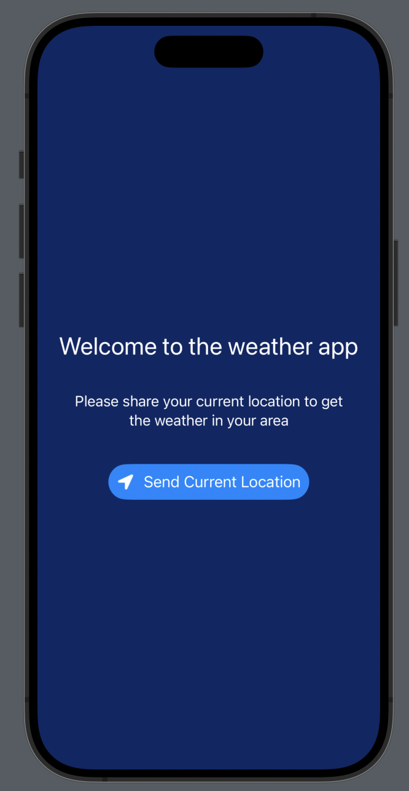
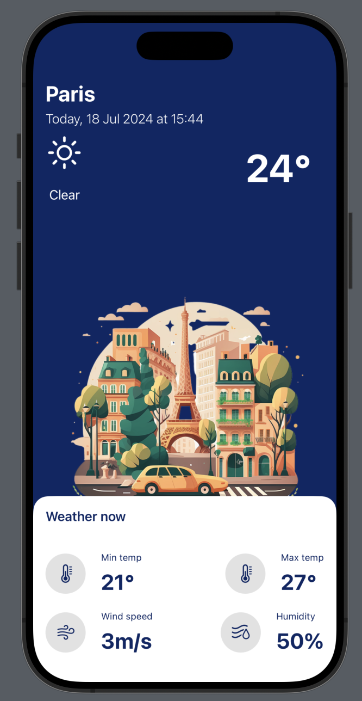

# Application Météo Mobile

## Description
Cette application mobile récupère la position de l’utilisateur pour lui fournir des températures précises en fonction de sa localisation. Le projet combine le langage Swift, le framework SwiftUI et l’API OpenWeather pour obtenir des données météorologiques fiables.

## Fonctionnalités
- Récupération de la position GPS de l'utilisateur.
- Affichage des températures actuelles en fonction de la localisation.
- Interface utilisateur moderne et intuitive grâce à SwiftUI.

## Technologies Utilisées
- **Langage**: Swift
- **Framework**: SwiftUI
- **API**: OpenWeather

## Captures d'écran

Voici quelques captures d'écran de l'application :

*Écran d'accueil montrant la température actuelle et la localisation.*

*Écran des détails affichant des informations météorologiques supplémentaires.*

## Prérequis
Avant de commencer, assurez-vous d'avoir les éléments suivants :
- Un Mac avec Xcode installé.
- Un compte développeur Apple pour tester sur un appareil physique (facultatif mais recommandé).
- Clé API OpenWeather.
